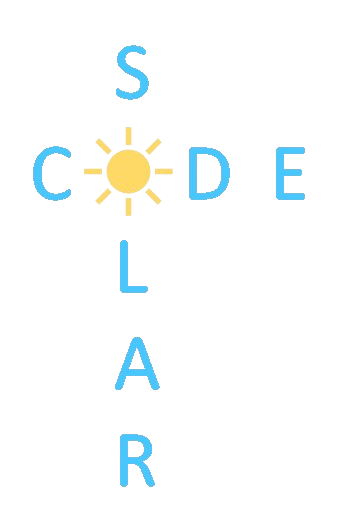

<h1 align="center" > Solar code</h1>
 

 
 
 
## Topic
SolarCode is your comprehensive resource for all things related to solar energy. Whether you're a homeowner looking to install solar panels, a student researching renewable energy, or an engineer developing solar technology, SolarCode has something for you.
 
## How to run the web
<ol>
<li> Download the latest release </li>
<li> Run the ... file </li>
</ol>

## Used technologies
-  Python  
-  HTML 
-  CSS  
-  JavaScript  
-  Jupyter Notebook  
-  Visual Studio Code  
-  React 
-  Microsoft Azure 
-  Microsoft PowerPoint  
-  GitHub  
 
## Features
✅ Simplistic looking interface.  
✅ Easiness of usage.  
✅ Interactive Maps 
 
## Our Team
- <a href="https://github.com/ATSivkov21"> Alexander Sivkov (Data Analyst) </a> 
- <a href="https://github.com/ATApostolov21"> Atanas Apostolov (Scrum Trainer)</a>  
- <a href="https://github.com/BSBadalova21"> Bilyana Badalova (Scrum Trainer) </a> 
- <a href="https://github.com/VBPendashev21"> Valentin Pendashev (Data Analyst)</a>  
- <a href="https://github.com/GEKalashnik21"> Grigoriy Kalashnik (Data Analyst) </a> 
- <a href="https://github.com/DKByandov21"> Dimitar Byandov (Frontend Developer)</a>  
- <a href="https://github.com/DDPeev21"> Dobril Peev (Backend Developer) </a> 
- <a href="https://github.com/LPApostolov21"> Lazar Apostolov (Frontend Developer)</a>  
## See our documents here
 [Presentaion](https://github.com/codingburgas/2324-10-volt-ai-solarcode/volt/docs/Presentation.pptx)  
 
##
